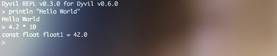

# The REPL

The first tool you can use the get started with Dyvil is it's official REPL (read-evaluate-print-loop). It allows you to enter any valid Dyvil expression and have it checked and evaluated by the program.



## Installation and Launching the REPL

To launch the REPL, you have to download the `dyvil-[version].jar` from any [Dyvil release](https://github.com/Dyvil/Dyvil/releases), where `[version]` is the version number of that release.

Example: `dyvil-0.6.0.jar`

After downloading the file, you can launch it using the `java` console command:

```sh
java -jar dyvil-0.6.0.jar
```

This will print text similar to the one shown in the above example. As soon as the `>` sign appears, the REPL has finished doing it's initialization and you may start typing.

## Supported Input

The REPL mainly supports any Dyvil expressions and statements, which you can learn about in the respective pages of this documentation.

