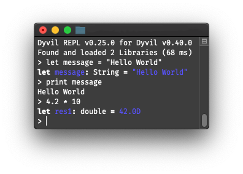

# The REPL

The first tool you can use to get started with Dyvil is it's official REPL (**R**ead-**E**valuate-**P**rint-**L**oop). It allows you to enter any valid Dyvil expression and have it checked and evaluated by the program.



## Installing and Launching the REPL

To use the REPL, you have to download the `dyvil-X.Y.Z.jar` file from any [Dyvil Release Page](https://github.com/Dyvil/Dyvil/releases), e.g. `dyvil-0.40.0.jar`.

After downloading the file, you can launch it using the `java` console command:

```sh
java -jar dyvil-0.40.0.jar
```

This will print text similar to the one shown in the above example. As soon as the `>` sign appears, the REPL has finished doing it's initialization and you may start typing.

## Supported Language Elements

The REPL can process any Dyvil [expression](expressions.md) and [statement](statements.md), which you can learn about in the respective pages of this documentation.

Furthermore, it also supports these class- and header-level declarations:

- [Fields](classes/fields.md)

```java
> var i = 10
var i: int = 10
> var s = "abc"
var s: String = abc
> var tuple = (1, "a", false)
var tuple: (int, String, boolean) = (1, a, false)
```

- [Methods](classes/methods.md)

```java
> func add(i: int, j: int) = i + j
func add(i: int, j: int) -> int = i + j
> var result = add(1, 2)
var result: int = 3
```

- [Classes](classes.md), [Interfaces and Traits](classes/traits.md)

```java
> class Person {
      var name: String
      var age: int
  }
class Person...
> interface Callable<T> {
      func call() -> T
  }
interface Callable...
```

- [Import Declarations](headers/import-declarations.md)

```java
> import java.util.Date
import ...
> using dyvil.math.MathUtils._
...
> using dyvil.Strings
...
```

- [Operator Definitions](headers/operators.md)

```swift
> prefix operator ~~
...
> infix operator +- { precedence 150, associativity left }
...
> postfix operator !!
...
```

- [Type Aliases](headers/type-aliases.md)

```scala
> type StringList = List<String>
...
> type ToIntMap<K> = Map<K, int>
...
> type NestedMap<K1, K2, V> = Map<K1, Map<K2, V>>
...
```

## Commands

The REPL also supports internal REPL commands that are denoted by the `:[commandname] [arguments...]` syntax.

The following commands are predefined:

| Name(s) | Arguments | Action | Example
| ---- | --------- | ------ | -------
| `help`, `?` | - | Prints the available commands and their descriptions. | |
| `exit`, `shutdown` | exit code | Exits the current REPL instance | `exit 0` |
| `version` | - | Prints information about the current REPL and Dyvil installation. | |
| `dump` | directory | Sets the directory to which REPL Result class files (`.class`) are dumped. | `dump ./replbin` |
| `debug` | - | Enables or disables debug mode | |
| `variables` | - | Prints all custom defined variables | |
| `methods` | - | Prints all custom defined methods | |
| `complete`, `c` | Expression or Type | Displays available completions for the expression or type | `c List(1, 2, 3).` | 

It is not possible to define or use custom commands.