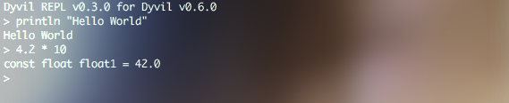

# The REPL

The first tool you can use the get started with Dyvil is it's official REPL (read-evaluate-print-loop). It allows you to enter any valid Dyvil expression and have it checked and evaluated by the program.



## Installation and Launching the REPL

To launch the REPL, you have to download the `dyvil-[version].jar` from any [Dyvil release](https://github.com/Dyvil/Dyvil/releases), where `[version]` is the version number of that release.

Example: `dyvil-0.6.0.jar`

After downloading the file, you can launch it using the `java` console command:

```sh
java -jar dyvil-0.6.0.jar
```

This will print text similar to the one shown in the above example. As soon as the `>` sign appears, the REPL has finished doing it's initialization and you may start typing.

## Input

The REPL allows you to enter expressions and submit them by pressing the enter key. However, there are a few situations in which the enter key will not evaluate the expression, but add a newline instead:

- Unbalanced Parenthesis

  In the case that the parenthesis or brackets in your expression are not balanced, the REPL will insert newlines. This will happen until all three types of brackets (`()`, `[]` and `{}`) are balanced:
  
  ```java
  > class Person {   // newline
        String name  // newline
        int age      // newline
    }
  > [  // newline
    1, // newline
    2, // newline
    3, // newline
    ]
  ```
  
 Within curly brackets `{}`, your code will automatically indented by one tab symbol per nesting level.
  
- Strings

  Unclosed single-quoted or double-quoted String literals also prevent the REPL from evaluating your expressions. This allows you to enter multi-line Strings without trouble:

  ```java
  > "Hello
    World"
  ```
  
  Note that parenthesis within String literals are excluded from the above rules and have no impact on the newlines inserted by the REPL.

## Supported Language Elements

The REPL mainly supports any Dyvil [expressions](expressions.md) and [statements](statements.md), which you can learn about in the respective pages of this documentation.

Furthermore, it also supports these class-level and header constructs:

- Variables

```java
> int i = 10
static int i = 10
> String s = "abc"
static String s = abc
> auto tuple = (1, "a", false)
static (int, String, boolean) tuple = (1, a, false)
```

- Methods

```java
> int add(int i, int j) = i + j
Defined Method 'static int add(int, int)'
> int result = add(1, 2)
static int result = 3
```

- Classes

```java
> class Person {
    String name;
    int age
  }
Defined class Person
```

- Import, Using and Include Declarations

```java
> import java.util.Date
> using dyvil.math.MathUtils._
> include dyvil.Strings
```

- Operator Definitions

```java
> prefix operator ~~
> infix operator +- { precedence 150, associativity left }
> postfix operator !!
```

## Commands

The REPL also supports internal REPL commands that are denoted by the `:[commandname] [arguments...]` syntax.

The following commands are predefined:

| Name(s) | Arguments | Action | Example
| ---- | --------- | ------ | -------
| `help`, `?` | - | Prints the available commands and their descriptions. | |
| `exit`, `shutdown` | exit code | Exits the current REPL instance | `exit 0` |
| `version` | - | Prints information about the current REPL and Dyvil installation. | |
| `dump` | directory | Sets the directory to which REPL Result class files (`.class`) are dumped. | `dump ./replbin` |
| `debug` | - | Enables or disbles debug mode | |
| `variables` | - | Prints all custom defined variables | |
| `methods` | - | Prints all custom defined methods | |

It is not possible to define or use custom commands.